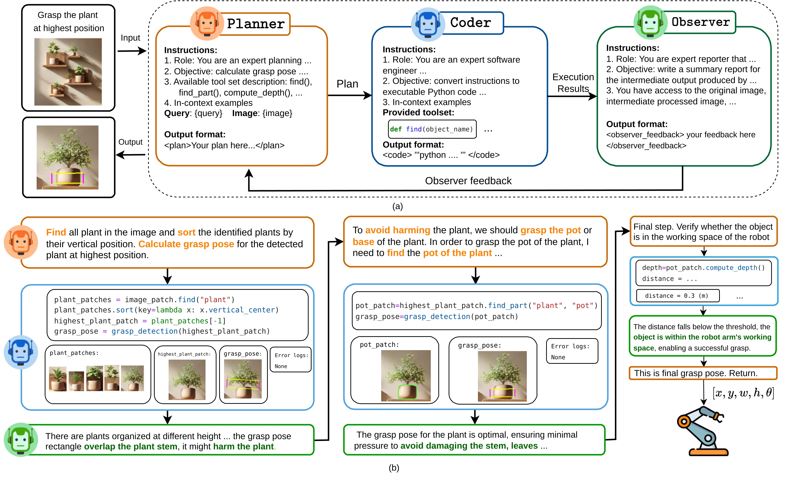
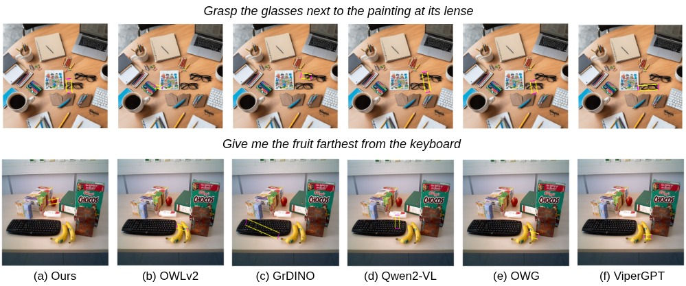
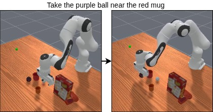

<div align="center"><h1> GraspMAS: Zero-Shot Language-driven Grasp Detection with Multi-Agent System<br>
</h1>
<p align="center">
    <a href="https://scholar.google.com/citations?user=F5Fr2ysAAAAJ&hl=vi" style="text-decoration: none;">Quang Nguyen</a> •
    <a href="https://scholar.google.com/citations?user=t6RXOWgAAAAJ&hl=vi" style="text-decoration: none;">Tri Le</a> •
    <a href="https://scholar.google.com/citations?user=T_LryjgAAAAJ&hl=en" style="text-decoration: none;">Huy Nghuyen</a> •
    <a href="https://sites.google.com/tdtu.edu.vn/vongocthieu" style="text-decoration: none;">Thieu Vo</a> •
    <a href="https://scholar.google.it/citations?user=KUqlbGUAAAAJ&hl=en" style="text-decoration: none;">Tung Ta</a> •
    <a href="https://scholar.google.com/citations?user=unbPvWAAAAAJ&hl=zh-CN" style="text-decoration: none;">Baoru Huang</a> •
    <a href="https://scholar.google.com/citations?hl=th&user=qyExc4QAAAAJ&view_op=list_works" style="text-decoration: none;">Minh Vu</a> •
    <a href="https://www.csc.liv.ac.uk/~anguyen/" style="text-decoration: none;">Anh Nguyen</a>
</p>
<h1><sub><sup><a href="https://www.iros25.org/">IROS 2025</a></sup></sub></h1>

[](https://zquang2202.github.io/GraspMAS/) 
[](https://arxiv.org/abs/2506.18448)

</div>

# Introduction

In this paper, we introduce GraspMAS, a new multi-agent system framework for language-driven grasp detection. GraspMAS is designed to reason through ambiguities and improve decision-making in real-world scenarios.



Our method consistently produces more plausible grasp poses than existing methods.
# Installation
Follow these steps to install the GraspMAS framework:

1. **Clone recursively:**
    ```bash
    git clone --recurse-submodules https://github.com/Fsoft-AIC/GraspMAS.git
    cd GraspMAS
    ```

2. **OpenAI key:** To run the GraspMAS framework, you will need an OpenAI key. This can be done by signing up for an account and then creating a key in account/api-keys. Create a file api.key in the root of this project and store the key in it.
    ```
    echo YOUR_OPENAI_API_KEY_HERE > api.key
    ```

3. **Prepare environment:**
   ```bash
    conda create -n graspmas python=3.9 -y
    conda activate graspmas
    conda install -c "nvidia/label/cuda-11.8.0" cuda-toolkit
    conda install pytorch==2.2.0 torchvision==0.17.0 torchaudio==2.2.0 pytorch-cuda=11.8 -c pytorch -c nvidia
    pip install -r requirements.txt
    cd detectron2
    pip install -e .
    cd ..
   ```

4. **Download pretrained model:**

    ```bash 
    bash download.sh
    ```
# Quickstart
- You can start checking the notebook ```simple_demo.ipynb``` for simple demo inference. This notebook includes details instructions and executing queries with visualization. You can run either the complete closed-loop pipeline or the open-loop mode with Coder.
- If you want to run inference on a single image, use the following:
```bash
python main_simple.py \
    --api-file "api.key" \
    --max-round 5 \
    --query "Grasp the knife at its handle" \
    --image-path PATH-TO-INPUT-IMAGE \
    --save-folder PATH-TO-SAVE-FOLDER
```

# Configuration
If you want to customize tools or model hyperparameters and configurations, please refer to **`image_patch.py`**. We have only developed sufficient tools for language-driven grasp detection. The GraspMAS framework heavily depends on the effectiveness of pretrained models as tools, so results may be biased. Feel free to add or remove any pretrained models related to image or video processing, including any up-to-date models. Note that some models, such as BLIP or VLM, may require significant GPU memory.

# Maniskill Demo with GraspMAS
<p align="center">
    
</p>

We provide the notebook demo **`Maniskill_demo.ipynb`** for simulating language-driven grasp detection on the ManiSkill simulator. The simulation runs in a tabletop environment using a Panda robot arm equipped with a wrist camera.

The notebook includes detailed instructions on how to:

* Initialize the tabletop environment
* Visualize observations
* Use GraspMAS to generate grasp pose rectangles
* Convert them to 6-DoF grasp poses
* Manipulate the robot arm accordingly

# Note
This is a research project, so the code may not be optimized, regularly updated, or actively maintained.

# Citation
If you find our work useful for your research, please cite:
```
@inproceedings{nguyen2025graspmas,
      title = {GraspMAS: Zero-Shot Language-driven Grasp Detection with Multi-Agent System},
      author = {Nguyen, Quang and Le, Tri and Nguyen, Huy and Vo, Thieu and Ta, Tung D and Huang, Baoru and Vu, Minh N and Nguyen, Anh},
      booktitle = IROS,
      year      = {2025}
  }
```
# Acknowledgement
We thank the valuable work of [ViperGPT](https://github.com/cvlab-columbia/viper), [ViperDuality](https://github.com/duality-robotics/viper/tree/main) that inspired and enabled this research.